# UniLink

[原型设计](https://www.figma.com/design/0UL6vGH95oFVeFNIzFBKCM/) [Blog](https://www.cnblogs.com/starryship/p/18430102)

`Uni` 代表 `University（大学）`，`Link` 表示 `连接`。UniLink 表达了连接不同学科、不同背景的大学生，建立跨学科交流的桥梁。

### 页面展示

------

### 功能展示

------

#### 注册

输入基本信息，注册账号

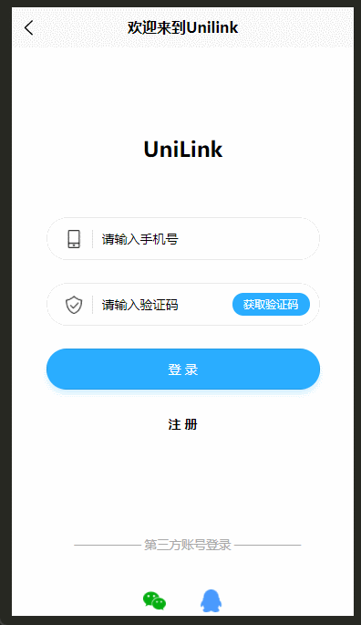

#### 申请项目

根据推荐的项目，可自主选择心仪的项目进行申请

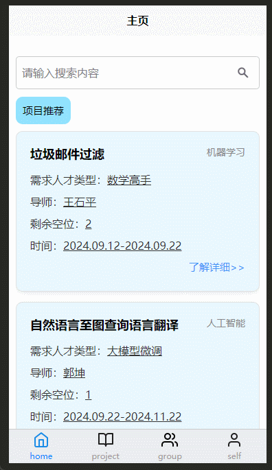

#### 任务安排

对于已经参加的项目，我们可以选择管理，进行任务分配

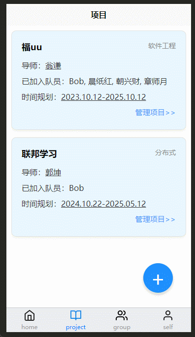

#### 创建项目

可以进行新项目的创建

#### 聊天功能

可以此和合作伙伴一起聊天

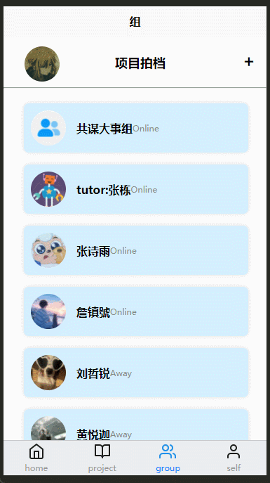

#### 添加好友

添加新的合作伙伴

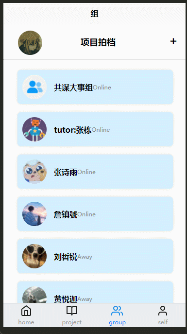

### 安装

以下提供三种方法使用该软件，不同方法所呈现的效果不一样，请根据需求进行选择

> 注意，以下安装过程只展示到app开始界面，要进入app的话得先注册。因为该app的短信验证并不能正真发出短信到你的手机，所以注册界面的验证码可以随便填，注册完成后回到登陆页面，输入一个正确的手机号，然后随便填一个验证码就能进入app了。

#### 编译器运行

------

> 注意，编译器运行时可能会要求下一些插件，点击弹窗的确定下载就行

1. 我们使用的开发工具为HBuilderX，可点击以下链接根据**操作系统**进行选择下载**正式版**，：[HBuilderX-高效极客技巧 (dcloud.io)](https://www.dcloud.io/hbuilderx.html)

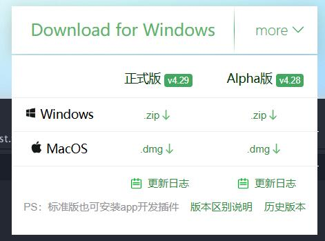

2. 将本仓库克隆下来

   `git clone https://github.com/Starryship/UniLink.git`

3. 打开HBuilderX，点击`文件->导入->从本地目录导入`

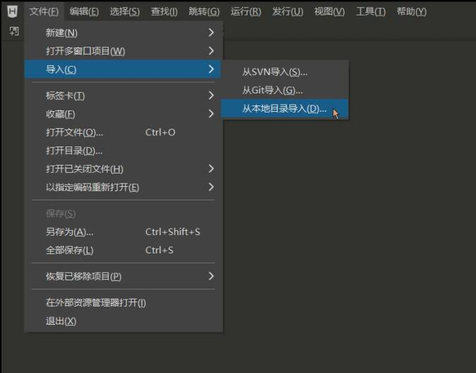

4. 选择刚刚克隆下来的文件

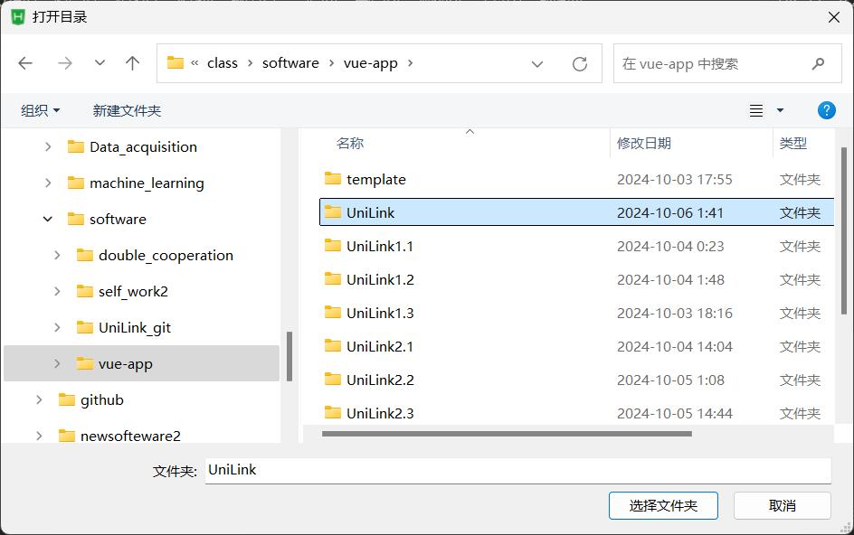

5. 点击运行，选择运行到内置浏览器或者外部浏览器都可以

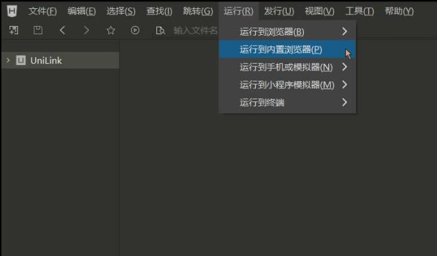

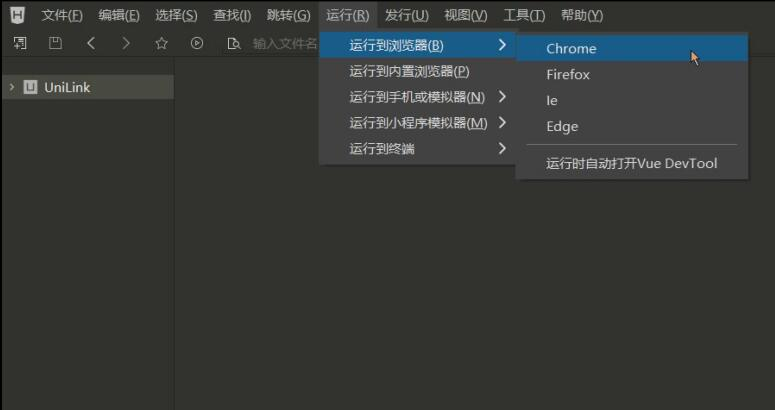

7.运行至内置浏览器，修改运行模拟器为iPhone 6/7/8

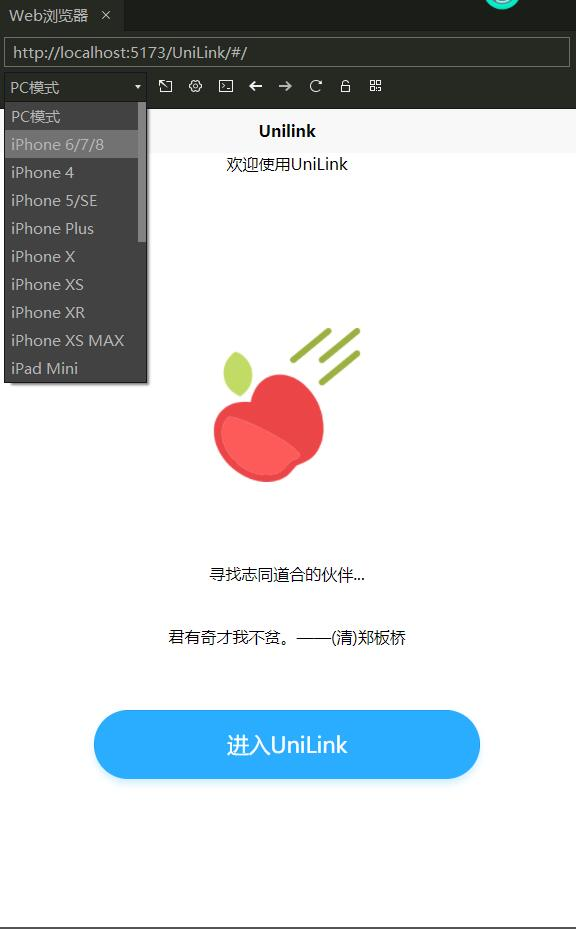

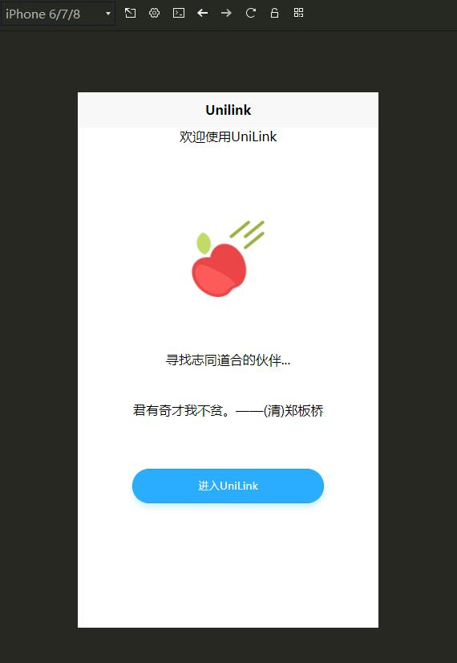

8.运行至外部浏览器，`点击右键->点击检查`

> 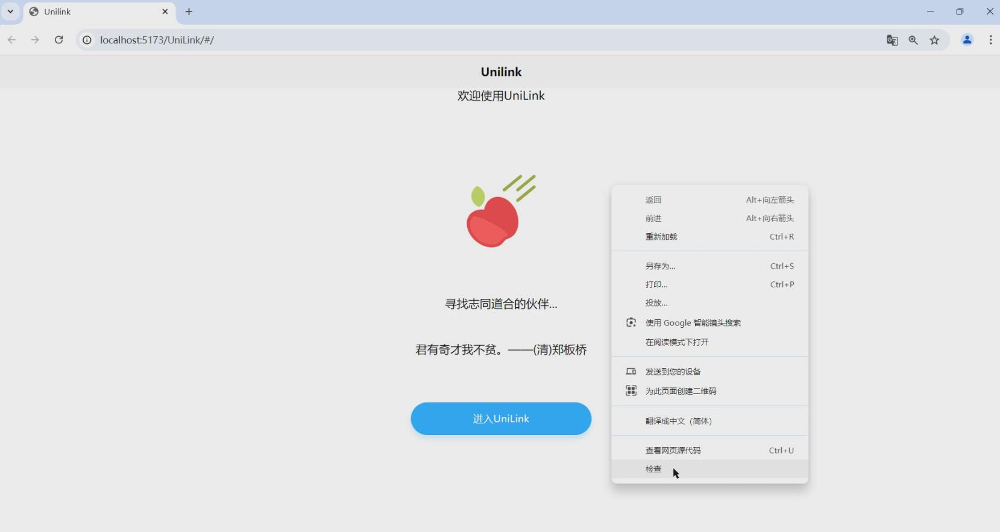
>
> 修改为移动设备展示
>
> 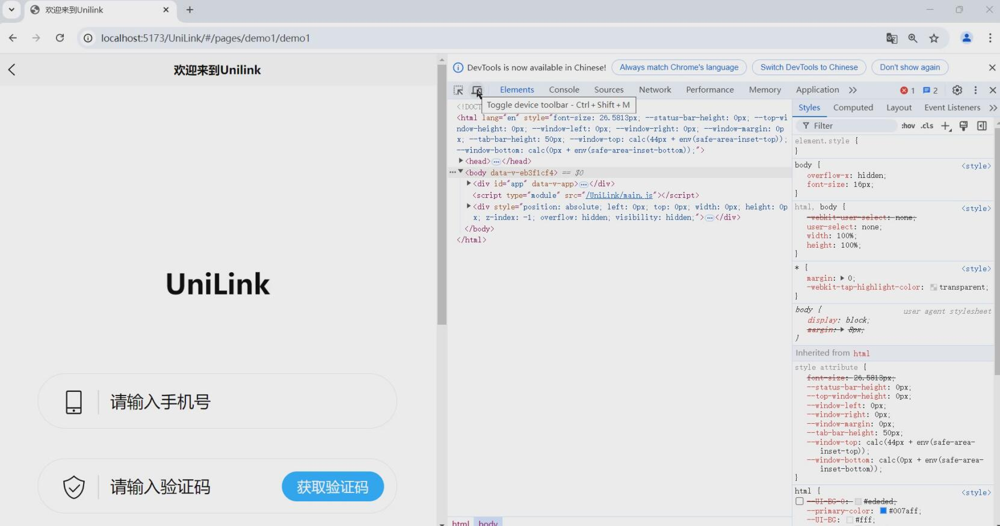
>
> 成功显示
>
> 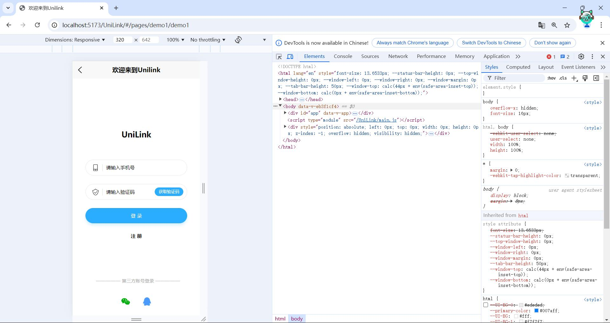

#### 网页运行

------

该app使用uniCloud进行前端网页托管，已经部署到云服务器上了，想要使用该app可以点击以下链接直接使用：static-mp-6cbf5855-4ae2-4eb0-9d2e-286e1c78e64a.next.bspapp.com

> 因为我们制作的是移动端app，所以在电脑打开此链接需要按照上面“编译器运行”方式中的步骤八调整网页，使其能正常显示。
>
> 移动端可以直接打开，移动端打开更佳。

#### 下载安装包

------

> 目前只提供安卓的安装包

点击以下链接即可安装：https://github.com/Starryship/UniLink/releases/download/v1.0/UniLink.apk

移动端点击后可以直接安装，pc端点击则需将下载后的apk文件发送给移动端，使用移动端安装。

#### 小程序

------
目前是打算上传到微信小程序端，但是备案还在审核中，敬请期待~
